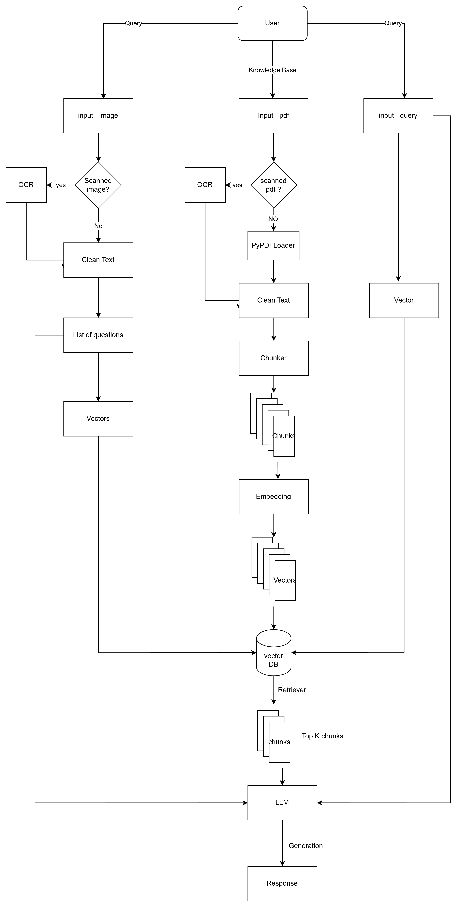

# AI-Powered Document Intelligence System

AI-Powered Document Intelligence System is a complete end-to-end RAG application that transforms raw documents (PDFs, scanned images, academic notes, question papers, etc.) into an intelligent conversational assistant.

It automatically extracts, cleans, chunks, embeds, stores, and retrieves information, allowing users to ask natural language questions and get accurate answers grounded in the uploaded documents.

This project is built with FastAPI, LangChain, HuggingFace Embeddings, Vector Databases, and LLM-based retrieval.

## 🚀 Features
### 📄 1. PDF Parsing & Text Extraction

- Extract text from multi-page PDFs
- Clean noisy text & formatting
- Handle scanned PDFs with OCR

### 🔍 2. Intelligent Chunking

- Recursive Character Splitter
- Prevents context loss
- Balanced chunk size for optimal retrieval

### 3. Embeddings + Vector Storage

- HuggingFace embeddings
- FAISS / Chroma vector stores
- Fast semantic similarity search

### 4. Retrieval-Augmented Generation (RAG)

- Retrieve the most relevant chunks
- Serve answers grounded in the documents
- Reduces hallucination


## System Architecture




## Technologies Used

 - Backend: FastAPI
 - Frontend: Streamlit
 - OCR: PaddleOCR (for images and scanned PDFs)
 - LLM: Mistral-7B via HuggingFace Endpoint
 - Vector Database: Chroma, LangChain embeddings


## ▶️ How It Works

1) Upload PDF or image
2) System extracts and cleans text
3) Text is chunked and embedded
4) Embeddings stored in vector DB
5) User asks a question
6) Retriever finds relevant chunks
7) LLM produces final grounded answer


**Environment & Prerequisites**
- Python 3.11+ recommended (project uses a venv at `myenv` in this repo)
- GPU users: Paddle/PaddleOCR may require compatible CUDA / cuDNN versions (see warnings below)
- Required environment variable:
  - `HUGGINGFACE_API` — Hugging Face API key for model calls

**Setup (local)**
1. Activate venv (PowerShell):

```powershell
python -m venv myenv
```

2. Install dependencies (if not already):

```powershell
pip install -r requirements.txt
```
3. Add your HuggingFace API key to .env file:

```powershell
HUGGINGFACE_API=<your-api-key>
```

**Run**
- Start backend (uvicorn):

```powershell
uvicorn backend.agents.main:app --reload --host 127.0.0.1 --port 8000
```

- Start frontend (Streamlit):

```powershell
cd frontend
streamlit run test.py
```

## Usage Notes

 - OCR can be slow for high-resolution or text-heavy images and scanned PDFs; patience is required.
 - For large PDFs, split documents into smaller files to avoid LLM token limits.
 - Chat history is session-based; resetting the session will clear context.


